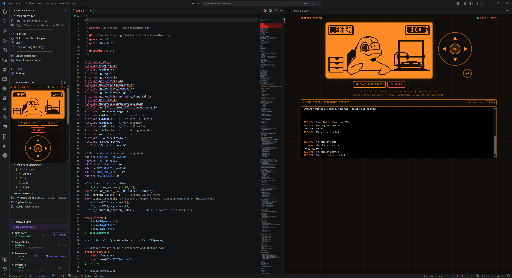
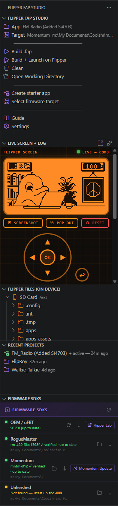
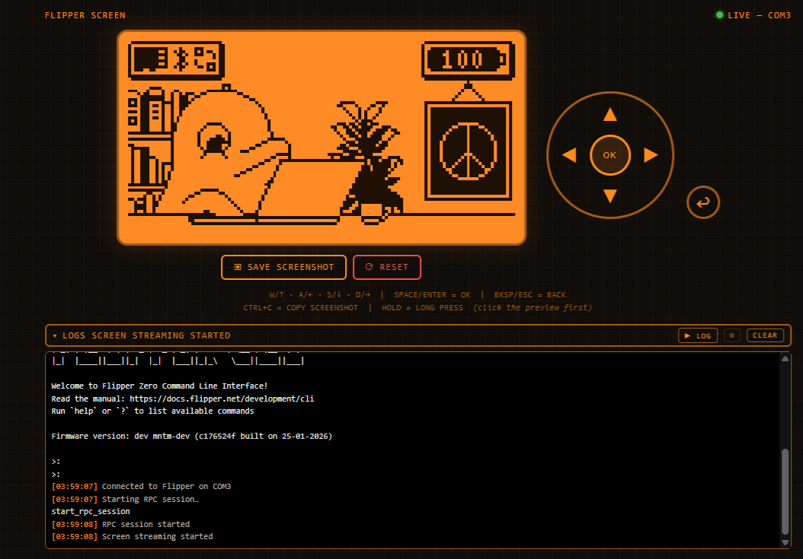
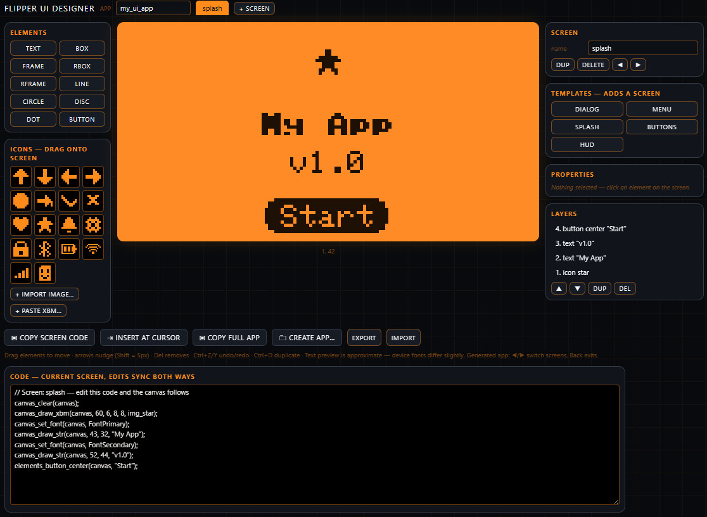
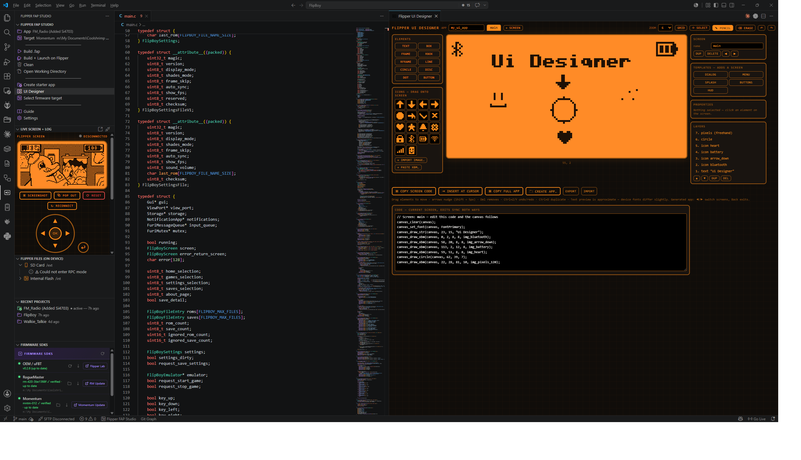
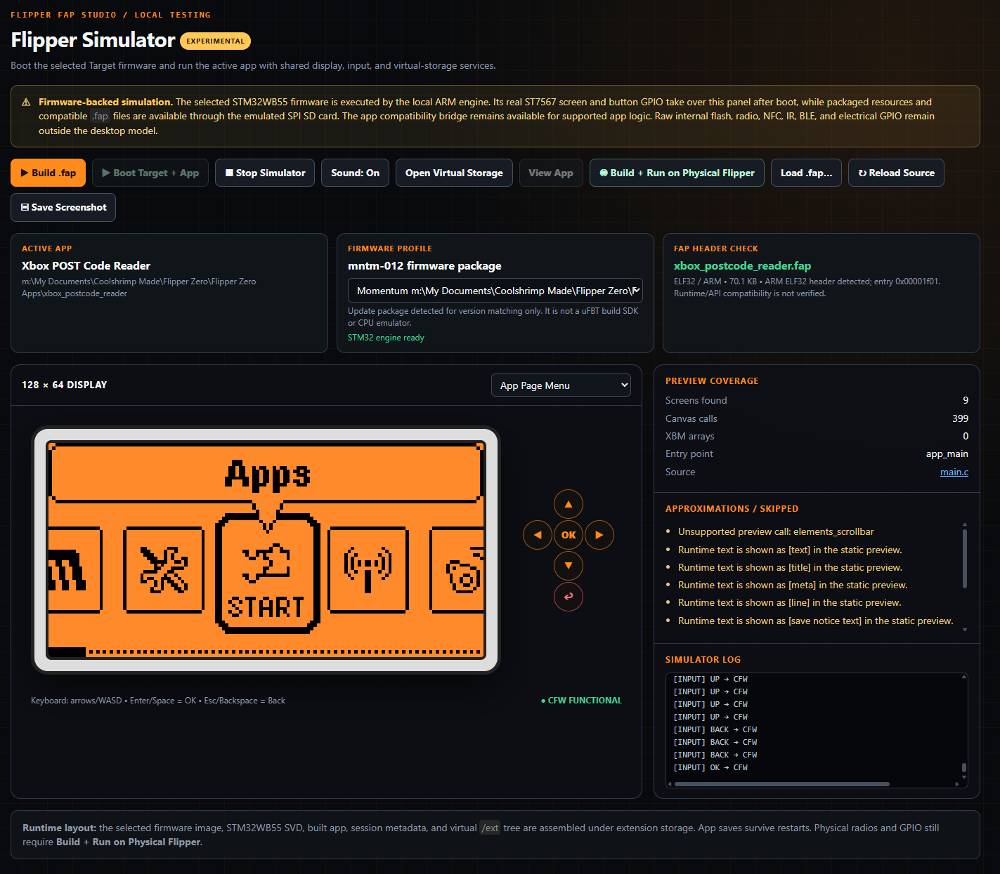

# Flipper FAP Studio

[](https://marketplace.visualstudio.com/items?itemName=coolshrimp.flipper-fap-studio)
[](https://marketplace.visualstudio.com/items?itemName=coolshrimp.flipper-fap-studio)

A GUI-first VS Code extension for building Flipper Zero `.fap` apps with uFBT.  
No command line required — just buttons, status, and output logs.  
Now with a **UI Designer** (design 128×64 screens visually, lopaka-style, and generate a complete buildable app), an experimental **Flipper Simulator** (safe offline Canvas preview plus an exact connected-device path), a **live screen mirror + device log** panel, a **Device Dashboard**, an **on-device file browser**, and **verified firmware SDKs** with latest-release checks.

## Why I built this

I created this tool to speed up my own Flipper app development — mainly to easily
build and test the same app across the popular firmwares (OEM, RogueMaster, Momentum,
Unleashed) without juggling command lines and SDK paths. Sharing it free with the
community that Flipper's open source ecosystem was built on, in the hope it helps
others build and test their own apps too. More free tools to come.

---

## Requirements

- [Python 3](https://www.python.org/) installed and on PATH
- [uFBT](https://github.com/flipperdevices/flipperzero-ufbt) — install via the extension's **Install / Update uFBT** button or manually:
  ```
  pip install ufbt
  ```
- VS Code 1.85 or newer

---

## Install

- **VS Code Marketplace (quick install)** — [**Install from the Marketplace**](https://marketplace.visualstudio.com/items?itemName=coolshrimp.flipper-fap-studio), or search for **Flipper FAP Studio** in the Extensions view (`Ctrl+Shift+X`)

Source code: [github.com/coolshrimp/flipper-fap-studio](https://github.com/coolshrimp/flipper-fap-studio)

---

## Quick Start

1. Click the Flipper icon in the Activity Bar
2. Click **Create starter app** — give it a name, choose a parent folder
3. Click **Flipper Simulator** for a static preview or a functional desktop run of the app's menus and storage
4. Click **Build .fap**
5. Plug in your Flipper Zero, click **Build + Launch on Flipper**
6. Expand **Live Screen + Log** in the sidebar to watch the real app run, drive it with your keyboard, and stream device logs

---

## Panel Layout



<p>


</p>

The sidebar shows the current app and target at the top, one-click build actions, the **Live Screen + Log** panel (real-time display mirror with controls and the device log), the **Flipper Files (on Device)** browser, your Recent Projects, and live Firmware SDK status with inline install/update buttons.

> Tip: VS Code remembers the height you drag each sidebar section to (per workspace), and you can drag any panel out to the Secondary Side Bar (`Ctrl+Alt+B`) for more room.

---

## Buttons

| Button | What it does |
|---|---|
| **Build .fap** | Runs `ufbt` against the active firmware target |
| **Build + Launch on Flipper** | Builds then runs `ufbt launch` to push and start the app on the connected Flipper |
| **Clean** | Runs `ufbt clean` to remove build artifacts |
| **Open Working Directory** | Opens `dist/` in Explorer (falls back to app root if dist doesn't exist yet) |
| **Create starter app** | Creates a new folder with `application.fam` + working `main.c` boilerplate and opens it in the workspace |
| **UI Designer** | Visual 128×64 screen editor — drag & drop elements/icons, multiple screens, generates `canvas_*` code or a whole app (see below) |
| **Flipper Simulator** | Experimental popup with safe static previews, a functional desktop C runtime, virtual storage, target-aware builds, screenshots, and exact testing on a connected Flipper (see below) |
| **Device Dashboard** | Live device stats over USB — battery, storage, firmware/hardware info, and library counts (see below) |
| **Select firmware target** | QuickPick to choose OEM, RogueMaster, Momentum, Unleashed, or a custom SDK path |
| **Guide** | Opens the step-by-step usage guide |
| **Settings** | Opens the extension's settings panel (build output, new-app defaults, SDK paths) |

The **Recent Projects** view lists every valid Flipper app you've created, opened, or built, newest first. Click one to switch the extension to that app folder instantly; inline buttons open the project in a new VS Code window or remove it from the list. Only folders containing an `application.fam` are tracked.

The **Firmware SDKs** view below the buttons shows each SDK's status live — whether uFBT is installed and up to date (checked against PyPI), and each custom-firmware folder **verified for real**: the extension scans the folder (several levels deep — nested extract-in-a-folder layouts are fine) for `update.fuf` manifests, shows the exact firmware version found (e.g. `mntm-012 ✓ verified`), and compares it against the latest GitHub release (`mntm-012 → mntm-013 available`). Point several targets at one parent folder and each finds its own firmware — and if a scan turns up a firmware sitting under the *wrong* target, it's assigned to the right one automatically. Anything unverifiable simply shows `Not found — latest <tag>`. The ↻ button in the panel header re-checks everything; inline buttons install/update uFBT, set paths, open release pages, and jump to each firmware's **web updater** — Flipper Lab (OEM), Momentum, Unleashed, and RogueMaster (opens lab.flipper.net pre-loaded with the latest RM build). Build failures are matched against common problems (Flipper not detected, API mismatch, missing includes, …) and shown as actionable hints.

---

## UI Designer

A built-in visual editor for Flipper screens, in the spirit of [lopaka.app](https://lopaka.app/) — click **UI Designer** in the sidebar:






- **Design on a live 128×64 canvas** (zoom 3–10×, pixel grid, orange device theme) with text (all four Flipper fonts), boxes, frames, rounded variants, lines, circles, discs, dots — plus the standard Flipper **soft-buttons** (`elements_button_left/center/right`) with inverted-label preview
- **Pixel-perfect drawing** — ✎ PENCIL and ⌫ ERASE tools paint freehand pixels onto a movable layer that exports as auto-cropped XBM
- **Custom images** — **Import Image** converts any PNG/JPG to 1-bit with live threshold/invert preview and auto-generates the XBM; **Paste XBM** for existing bitmaps; custom icons are saved with the design
- **Icon palette with drag & drop** — built-in icons (arrows, battery, wifi, bluetooth, gear, heart, star, …)
- **Starter templates** — one click adds a prefab screen: **Dialog**, **Menu**, **Splash**, **Button bar**, or **HUD**
- **Live code panel with two-way sync** — the generated `canvas_*` code for the current screen sits right below the canvas; drag elements and the code updates, or **edit the code and the canvas follows**
- **Multiple screens per app** — tab bar to add/rename/duplicate/reorder/delete screens
- **Full editing** — drag to move, **resize handles** (rect corners, circle radius, line endpoints), arrow-key nudge, layers panel with z-order, per-element properties, duplicate/delete, undo/redo (Ctrl+Z / Ctrl+Y)
- **Rearrangeable workspace** — drag any tool panel by its header to reorder or move it between columns; your layout is remembered
- **Code generation that actually builds**:
  - **Copy Screen Code** — the `canvas_*` draw calls (+ icon XBM arrays) for the current screen
  - **Insert at Cursor** — drop that snippet straight into the file you're editing
  - **Copy Full App** — a complete `main.c` with a screen enum, draw/input callbacks, and ◀/▶ screen switching
  - **Create App…** — scaffolds a ready-to-build app folder (`application.fam` + `main.c`) and makes it the active app
- Designs autosave, and **Export/Import JSON** lets you keep them with your project

*Text preview uses a close 5×7 approximation — exact pixel metrics can differ slightly on device fonts.*

---

## Flipper Simulator (experimental)

Click **Flipper Simulator** in the sidebar to boot the firmware selected as **Target** and run the active app in a dedicated VS Code popup. Firmware and trusted app code execute in separate child processes; neither executes inside the VS Code extension host.



### How the STM32 emulator works

1. **Prepare the target.** The extension locates the selected OEM or custom firmware image and its STM32WB55 SVD hardware description, then safely expands any packaged update resources.
2. **Build the virtual Flipper.** It compiles the active app, installs the `.fap` into a persistent virtual `/ext` tree, and turns that tree into the FAT16 SD-card image seen by the firmware.
3. **Boot real firmware instructions.** The bundled ARM engine starts at the firmware reset vector and models the Cortex-M exception path plus the STM32 peripherals needed for boot, display, buttons, storage, timing, and sound.
4. **Connect the simulator controls.** ST7567 display traffic becomes the 128×64 panel, D-pad actions become GPIO/EXTI events, SPI2 reads and writes reach the virtual SD card, and speaker PWM becomes capped PC audio.
5. **Run supported app behavior.** A separate compatibility process runs the app's trusted C entry point and supported Furi/GUI APIs against the same display, input, and storage services.
6. **Keep test data.** When the session stops, SD-card writes are merged back into virtual storage so app saves and test files remain available for the next run.

This is a practical firmware-and-app development model, not a complete electrical replica. Radio, NFC, infrared output, Bluetooth/wireless-core behavior, raw internal flash, and physical GPIO still require a real Flipper Zero.

- **Run Selected App** builds the app when necessary, finds the selected Target's `full.bin`/`firmware.bin` or extracts its DfuSe `firmware.dfu`, and starts the STM32WB55 ARM engine
- The built `.fap` is installed under a persistent virtual `/ext/apps/<category>` tree and recorded with the exact firmware/SVD inputs in `session.json`
- Firmware update resources are discovered from `components.json`/`update.fuf`, safely extracted from TAR, gzip, or Heatshrink packages, and copied to the same virtual SD card before boot
- The raw STM32 firmware mounts that tree through an emulated SPI2 SD card backed by a FAT16 image; firmware-created files are merged back before the next launch so saves persist
- Firmware buzzer PWM, FAP speaker calls, and common notification beeps play through the PC at a safe capped level; use **Sound: On/Off** in the simulator toolbar
- Hold an on-screen control or its keyboard equivalent for about half a second to send a long press, such as **hold Back** to leave certain menus or **hold OK** to open contextual menus
- Update-only custom firmware packages may use the managed OEM STM32WB55 SVD while retaining their own firmware image
- The app API bridge starts alongside the firmware engine, running the app's real entry point, menu branches, input callbacks, queues, and supported API calls against the same virtual storage
- The selected firmware's real ST7567 SPI traffic is decoded into the panel, so OEM and CFW boot screens, desktop, and firmware-owned menus replace the bridge preview as soon as the firmware draws them
- D-pad actions are injected with each Flipper button's real GPIO polarity and matching EXTI pending/interrupt state; early clicks wait for the firmware's GPIO baseline and desktop event loop, allowing reliable navigation of the raw firmware UI from its first screen
- Runs common firmware GUI architecture directly: `View`, `ViewDispatcher`, `SceneManager`, Submenu, Widget, and Variable Item List modules, including scene transitions and real D-pad callbacks
- Supports Furi event loops, loop timers, regular timers, event flags, message queues, stream buffers, mutex events, thread exit signals, and `furi_hal_random`
- Canvas frames stream back into the 128×64 display, so D-pad and keyboard input drive the app instead of cycling guessed source screens
- Raw firmware `/ext` access and the app bridge's `/ext`/`/int` storage calls share the persistent virtual SD tree; after stopping the simulator, **Open Virtual Storage** synchronizes and reveals its actual contents for adding ROMs, saves, settings, and test files
- Generates missing `*_icons.h` headers from an app's `fap_icon_assets` PNG/PBM folder and renders those icons in the functional display; unresolved icon references receive a visible placeholder and warning
- Hardware-only source backends can be omitted from the desktop build and replaced with compatibility stubs; MP3 Player keeps its real menus, library, decoder state, and settings while physical audio output remains disabled
- A GCC-compatible desktop compiler is detected from the Pico SDK or `PATH`; an explicit executable can be set with `flipperFapStudio.desktopRuntime.compilerPath`
- The Windows VSIX includes the patched `nviennot/stm32-emulator` engine and its required DLL; `flipperFapStudio.stm32Runtime.executablePath` is available only when an alternate build is desired
- Renders common `canvas_*` calls—including left/center/right aligned text—XBM bitmap arrays, and `elements_button_*` soft buttons on a 128×64 qFlipper-palette display
- Composes bounded local draw-helper calls, parameter bindings, constant string arrays, arithmetic coordinates, and short canonical loops without executing C code
- Finds the real draw callback and exposes its `switch` cases (including `default`) as selectable screens; Left/Right or the keyboard cycles between them
- Shows unresolved runtime strings as marked placeholders instead of silently dropping the text
- Reloads automatically when `.c`, `.h`, or `application.fam` files change
- Uses the selected OEM, RogueMaster, Momentum, Unleashed, or custom local SDK profile for the existing build commands
- Finds or loads a `.fap` and checks for the expected little-endian ARM ELF32 header (runtime/API compatibility still requires a device)
- Saves a catalog-ready 512×256 two-color PNG screenshot
- **Build + Run on Physical Flipper** launches through uFBT and opens the existing live screen popup for device-accurate behavior

The firmware process performs real STM32WB55 ARM instruction execution, renders the selected firmware UI, mounts the packaged SD resources, browses native application folders, and can launch firmware-compatible FAPs through the firmware's loader. Because the physical wireless core is absent, the engine supplies a simulation-only result for the boot-time secure-enclave inventory; it does not emulate keys or cryptographic operations. Raw `/int` flash storage, NFC, Sub-GHz radio behavior, infrared output, Bluetooth/radio-core behavior, and electrical GPIO remain unavailable or stubbed, so hardware-dependent FAPs can still stop or report missing hardware. The app-facing compatibility bridge remains active for supported app UI and logic, Static mode remains available for untrusted source, and a connected Flipper remains the final hardware authority.

The concept was inspired by the archived, MIT-licensed [Flippulator](https://github.com/Milk-Cool/flippulator). This implementation is Windows-native, integrated with VS Code, and uses its own compatibility layer in an isolated process; it does not bundle Flippulator code.

---

## Device Tools (USB)

Everything below talks to the Flipper over its USB serial port directly — close qFlipper / lab.flipper.net first, since only one program can hold the port at a time.

### Live Screen + Log

One panel, qFlipper-style: the live display mirror with controls on top, and the combined log right below it. Streaming starts when the panel is visible and stops when it's collapsed, so it never hogs the port. Use **⧉ Pop Out** for a full-size editor tab.

- **D-pad / OK / Back** buttons, exactly like qFlipper
- **Keyboard control** while the preview is focused — `W/A/S/D` or arrow keys, `Space`/`Enter` = OK, `Backspace`/`Esc` = Back; **hold** any key for a long-press (with repeat)
- **▣ Save Screenshot** exports a crisp 4× PNG; **Ctrl+C** copies it straight to the clipboard
- **⟳ Reset** reboots the Flipper over RPC (click twice to confirm) — same effect as the LEFT+BACK combo, handy when an app freezes; the panel reconnects automatically once the device is back
- The **LOGS** box shows connection/RPC events (`[RPC] Screen streaming started`, …) and the device's debug log in one place — hit **▶ LOG** to stream the Flipper CLI log (ANSI colors, auto-scroll); the screen pauses while the log runs and resumes when you hit **■**
- If the COM port is held by another program, the panel says so — **COM BLOCKED** — and names the likely culprit (qFlipper, PuTTY, …) so you know what to close

**Builds and the serial connection share the port automatically:** when you hit **Build + Launch**, the stream/log pauses just long enough for uFBT to push the `.fap` to the device, then reconnects and resumes on its own — no manual disconnecting.

### Device Dashboard

Click **Device Dashboard** in the sidebar for a one-page health check of the connected Flipper — handy before a long test session:

- **Device card** — name, firmware version/branch/fork, hardware model and UID, plus an expandable **All Device Info** list with every key the firmware reports (great for bug reports)
- **Battery** — charge % with bar, voltage, current draw, temperature, and health
- **Storage** — SD card (`/ext`) and internal flash (`/int`) used/free/total with usage bars
- **Library counts** — Sub-GHz, Infrared, NFC, RFID, BadUSB, and Apps, counted live from the SD card (recursive scan with sane caps, so huge libraries stay fast; counts fill in as they finish)
- **↻ Refresh** re-reads everything; the dashboard borrows the RPC session only while loading, so it never holds the port
- **ᗬ Bluetooth (experimental)** — pair the Flipper with your PC (it shows a one-time 6-digit code — no default PIN), then click to connect over BLE; the dashboard stats, library counts, and **Install .fap** then work wirelessly, no cable. Click again to disconnect. Live Screen and the file browser sidebar remain USB-only for now.
- **⬇ Install .fap** — pick any built `.fap` and a `/ext/apps` category folder (read live from the device) and it uploads over USB or BLE

All of it uses the same read-only RPC calls as the rest of the extension — nothing is written to the device unless you install an app.

### Flipper Files (on Device)

The **Flipper Files (on Device)** view browses the connected device's **SD Card** (`/ext`) and **Internal Flash** (`/int`):

- Click a file to download and open a copy in the editor
- Upload multiple files at once, or **Upload Folder** to mirror a whole local folder (recursively) onto the device
- Create folders, rename, delete, download any file to disk, copy its device path
- Your **current app is highlighted** — the `.fap` built from the active app folder (and its category folder) get a green ★ marker, and the **⊙ Reveal Current App** title button jumps straight to it

File operations, the screen preview, and the serial log all coordinate over one connection — file operations briefly borrow the RPC session and the device log resumes when they're done.

---

## Firmware Targets

| Target | Default SDK path |
|---|---|
| OEM / uFBT | Uses the official uFBT SDK (no path needed) |
| RogueMaster | `C:\Flipper\RogueMaster` |
| Momentum | `C:\Flipper\Momentum` |
| Unleashed | `C:\Flipper\Unleashed` |
| Custom | Any folder you point it at |

Paths can be changed in VS Code Settings (`Ctrl+,`) under **Flipper FAP Studio**. Point a target at any folder containing the extracted firmware update package — subfolders are scanned several levels deep, several firmwares can share one parent folder, and each target auto-locks onto its own (verified via the `update.fuf` manifest).

---

## Settings

| Setting | Default | Description |
|---|---|---|
| `flipperFapStudio.defaultAppFolder` | `""` | Remembered app folder path |
| `flipperFapStudio.defaultTarget` | `"oem"` | Active build target |
| `flipperFapStudio.serialPort` | `""` | COM port of the Flipper (blank = auto-detect by USB VID/PID) |
| `flipperFapStudio.askOnBuildOutput` | `false` | Prompt for a destination folder after each successful build |
| `flipperFapStudio.buildOutputDir` | `""` | Auto-copy the built `.fap` here after each build (ignored when ask is on) |
| `flipperFapStudio.defaultCreateAppDir` | `""` | Default parent folder offered when creating a starter app |
| `flipperFapStudio.stm32Runtime.executablePath` | `""` | Optional emulator override; blank uses the bundled Windows STM32 engine |
| `flipperFapStudio.stm32Runtime.maxInstructions` | `0` | Stop a firmware probe after this many ARM instructions; zero runs until stopped |
| `flipperFapStudio.targets.rogueMasterPath` | `C:\Flipper\RogueMaster` | RogueMaster SDK path |
| `flipperFapStudio.targets.momentumPath` | `C:\Flipper\Momentum` | Momentum SDK path |
| `flipperFapStudio.targets.unleashedPath` | `C:\Flipper\Unleashed` | Unleashed SDK path |
| `flipperFapStudio.targets.custom` | `[]` | Array of custom `{name, path}` targets |

---

## Security

The extension never silently sends code or files anywhere.

- No auto-upload to GitHub
- No auto-download of firmware
- No auto-run of unknown scripts
- No token storage
- No secrets shown in logs
- Online checks are read-only version lookups (PyPI for uFBT, GitHub Releases for firmware tags) — nothing about you or your code is sent

---

## Developer Workflow (editing the extension itself)

1. Open `Flipper App Tool/` as a folder in VS Code
2. Press **F5** — launches Extension Development Host with live extension
3. Edit any `.ts` file and save — watch mode recompiles automatically
4. Press **Ctrl+R** in the dev host window to reload changes

To package a `.vsix` for sharing or permanent install:
```
npm run compile
npx vsce package --allow-missing-repository
```

---

## Planned Features

- [x] ~~Detect connected Flipper~~ — done in 0.8.0 (auto-detect + live screen, serial log, file browser)
- [x] ~~Device Dashboard~~ — done in 0.11.0 (battery, storage, firmware, library stats)
- [x] ~~BLE transport (experimental)~~ — done in 0.12.0 (dashboard + install over Bluetooth; live screen/file sidebar still USB)
- [ ] Package Release ZIP (excludes secrets, confirms before packaging)
- [ ] Multi-target batch build (OEM + all custom targets at once)
- [ ] Install built `.fap` directly into `/ext/apps` from the file browser
- [ ] BLE for Live Screen + file browser sidebar

---

## Links

- [VS Code Marketplace listing](https://marketplace.visualstudio.com/items?itemName=coolshrimp.flipper-fap-studio)
- [GitHub repository](https://github.com/coolshrimp/flipper-fap-studio)
- [Report an issue](https://github.com/coolshrimp/flipper-fap-studio/issues)
- [uFBT](https://github.com/flipperdevices/flipperzero-ufbt)

## License

[MIT](LICENSE)
