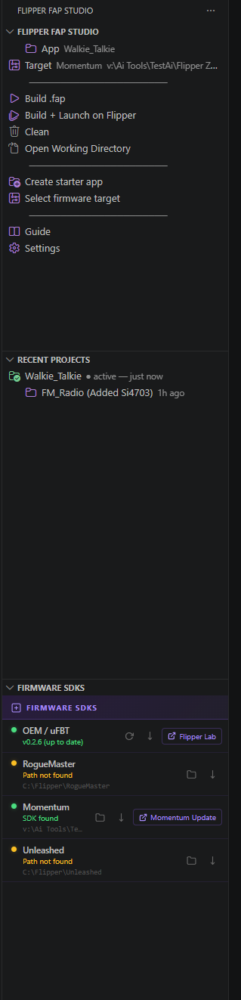

# Flipper FAP Studio

[](https://marketplace.visualstudio.com/items?itemName=coolshrimp.flipper-fap-studio)
[](https://marketplace.visualstudio.com/items?itemName=coolshrimp.flipper-fap-studio)

A GUI-first VS Code extension for building Flipper Zero `.fap` apps with uFBT.  
No command line required — just buttons, status, and output logs.  
Now with a **live screen preview** (control your Flipper from VS Code, qFlipper-style), a **serial log** panel, and a **device file browser** — all over the same USB cable you build with.

## Why I built this

I created this tool to speed up my own Flipper app development — mainly to easily
build and test the same app across the popular firmwares (OEM, RogueMaster, Momentum,
Unleashed) without juggling command lines and SDK paths. Sharing it free with the
community that Flipper's open source ecosystem was built on, in the hope it helps
others build and test their own apps too. More free tools to come.

---

## Requirements

- [Python 3](https://www.python.org/) installed and on PATH
- [uFBT](https://github.com/flipperdevices/flipperzero-ufbt) — install via the extension's **Install / Update uFBT** button or manually:
  ```
  pip install ufbt
  ```
- VS Code 1.85 or newer

---

## Install

- **VS Code Marketplace (quick install)** — [**Install from the Marketplace**](https://marketplace.visualstudio.com/items?itemName=coolshrimp.flipper-fap-studio), or search for **Flipper FAP Studio** in the Extensions view (`Ctrl+Shift+X`)
- **From VSIX (GitHub)** — download the latest `.vsix` from [GitHub Releases](https://github.com/coolshrimp/flipper-fap-studio/releases/latest), then `Ctrl+Shift+P` → **Extensions: Install from VSIX** and pick the downloaded file

Source code: [github.com/coolshrimp/flipper-fap-studio](https://github.com/coolshrimp/flipper-fap-studio)

---

## Quick Start

1. Click the Flipper icon in the Activity Bar
2. Click **Create starter app** — give it a name, choose a parent folder
3. Click **Build .fap**
4. Plug in your Flipper Zero, click **Build + Launch on Flipper**

---

## Panel Layout



The sidebar shows the current app and target at the top, one-click build actions, your Recent Projects, and live Firmware SDK status (installed version, up-to-date check, path found/missing) with inline install/update buttons.

---

## Buttons

| Button | What it does |
|---|---|
| **Build .fap** | Runs `ufbt` against the active firmware target |
| **Build + Launch on Flipper** | Builds then runs `ufbt launch` to push and start the app on the connected Flipper |
| **Clean** | Runs `ufbt clean` to remove build artifacts |
| **Open Working Directory** | Opens `dist/` in Explorer (falls back to app root if dist doesn't exist yet) |
| **Create starter app** | Creates a new folder with `application.fam` + working `main.c` boilerplate and opens it in the workspace |
| **Select firmware target** | QuickPick to choose OEM, RogueMaster, Momentum, Unleashed, or a custom SDK path |
| **Guide** | Opens the step-by-step usage guide |
| **Settings** | Opens the extension's settings panel (build output, new-app defaults, SDK paths) |

The **Recent Projects** view lists every valid Flipper app you've created, opened, or built, newest first. Click one to switch the extension to that app folder instantly; inline buttons open the project in a new VS Code window or remove it from the list. Only folders containing an `application.fam` are tracked.

The **Firmware SDKs** view below the buttons shows each SDK's status live — whether uFBT is installed and up to date (checked against PyPI), and whether each custom-firmware SDK path exists on disk — with inline buttons to install/update uFBT, set paths, and open release pages. Build failures are matched against common problems (Flipper not detected, API mismatch, missing includes, …) and shown as actionable hints.

---

## Device Tools (USB)

Everything below talks to the Flipper over its USB serial port directly — close qFlipper / lab.flipper.net first, since only one program can hold the port at a time.

### Live Screen Preview

Click **Live Screen Preview** in the sidebar (or run *Flipper FAP Studio: Live Screen Preview*) to mirror the device display in real time and control it remotely:

- **D-pad / OK / Back** buttons, exactly like qFlipper
- **Keyboard control** while the panel is focused — `W/A/S/D` or arrow keys, `Space`/`Enter` = OK, `Backspace`/`Esc` = Back; **hold** any key for a long-press (with repeat)
- **▣ Save Screenshot** exports a crisp 4× PNG; **Ctrl+C** copies it straight to the clipboard
- Collapsible **LOGS** strip showing connection and RPC events

### Serial Log

The **Serial Log** view streams the device's live debug log (`log` on the Flipper CLI) with ANSI colors and auto-scroll. Click **▶ Start** / **■ Stop** any time.

**Builds and serial logging share the port automatically:** when you hit **Build + Launch**, the log (or screen stream) pauses just long enough for uFBT to push the `.fap` to the device, then reconnects and resumes on its own — no manual disconnecting.

### Flipper Files

The **Flipper Files** view browses the connected device's **SD Card** (`/ext`) and **Internal Flash** (`/int`):

- Click a file to download and open a copy in the editor
- Upload files into any folder, create folders, rename, delete
- Download any file to disk, or copy its device path

File operations, the screen preview, and the serial log all coordinate over one connection — file operations briefly borrow the RPC session and the device log resumes when they're done.

---

## Firmware Targets

| Target | Default SDK path |
|---|---|
| OEM / uFBT | Uses the official uFBT SDK (no path needed) |
| RogueMaster | `C:\Flipper\RogueMaster` |
| Momentum | `C:\Flipper\Momentum` |
| Unleashed | `C:\Flipper\Unleashed` |
| Custom | Any folder you point it at |

Paths can be changed in VS Code Settings (`Ctrl+,`) under **Flipper FAP Studio**.

---

## Settings

| Setting | Default | Description |
|---|---|---|
| `flipperFapStudio.defaultAppFolder` | `""` | Remembered app folder path |
| `flipperFapStudio.defaultTarget` | `"oem"` | Active build target |
| `flipperFapStudio.serialPort` | `""` | COM port of the Flipper (blank = auto-detect by USB VID/PID) |
| `flipperFapStudio.askOnBuildOutput` | `false` | Prompt for a destination folder after each successful build |
| `flipperFapStudio.buildOutputDir` | `""` | Auto-copy the built `.fap` here after each build (ignored when ask is on) |
| `flipperFapStudio.defaultCreateAppDir` | `""` | Default parent folder offered when creating a starter app |
| `flipperFapStudio.targets.rogueMasterPath` | `C:\Flipper\RogueMaster` | RogueMaster SDK path |
| `flipperFapStudio.targets.momentumPath` | `C:\Flipper\Momentum` | Momentum SDK path |
| `flipperFapStudio.targets.unleashedPath` | `C:\Flipper\Unleashed` | Unleashed SDK path |
| `flipperFapStudio.targets.custom` | `[]` | Array of custom `{name, path}` targets |

---

## Security

The extension never silently sends code or files anywhere.

- No auto-upload to GitHub
- No auto-download of firmware
- No auto-run of unknown scripts
- No token storage
- No secrets shown in logs
- Sensitive files (`.env`, `*.pem`, `*.pfx`, `credentials.json`, etc.) are excluded from release ZIPs and flagged with a warning before packaging

---

## Developer Workflow (editing the extension itself)

1. Open `Flipper App Tool/` as a folder in VS Code
2. Press **F5** — launches Extension Development Host with live extension
3. Edit any `.ts` file and save — watch mode recompiles automatically
4. Press **Ctrl+R** in the dev host window to reload changes

To package a `.vsix` for sharing or permanent install:
```
npm run compile
npx vsce package --allow-missing-repository
```

---

## Planned Features

- [x] ~~Detect connected Flipper~~ — done in 0.8.0 (auto-detect + live screen, serial log, file browser)
- [ ] Package Release ZIP (excludes secrets, confirms before packaging)
- [ ] Multi-target batch build (OEM + all custom targets at once)
- [ ] Install built `.fap` directly into `/ext/apps` from the file browser

---

## Links

- [VS Code Marketplace listing](https://marketplace.visualstudio.com/items?itemName=coolshrimp.flipper-fap-studio)
- [GitHub repository](https://github.com/coolshrimp/flipper-fap-studio)
- [Report an issue](https://github.com/coolshrimp/flipper-fap-studio/issues)
- [uFBT](https://github.com/flipperdevices/flipperzero-ufbt)

## License

[MIT](LICENSE)
